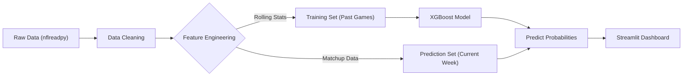

#  NFL Game Predictor: Advanced Efficiency Modeling

A Machine Learning application that predicts NFL game outcomes using advanced efficiency statistics (EPA/CPOE) and Walk-Forward Validation.


##  Demo 


https://github.com/user-attachments/assets/aa9a53b1-9c28-4471-9ba0-55efe45b7de1


##  Project Overview

This project aims to outperform traditional win/loss record-based predictions by leveraging play-by-play efficiency metrics. The application ingests real-time NFL data, processes advanced stats (Expected Points Added, CPOE), and trains an XGBoost model on a "Walk-Forward" basis to simulate real-world betting/prediction conditions.

### Key Features
*   **Walk-Forward Validation**: The model retrains every week, ensuring it only learns from data available prior to the game date.
*   **Advanced Metrics**: Utilizes granular play-by-play data (`nflreadpy`) rather than box scores.
*   **Interactive Dashboard**: A Streamlit web application allows users to visualize matchups, confidence intervals, and team power rankings.
*   **Context Aware**: Engineered features include Home Field Advantage, Rolling Efficiency stats (Last 4 Weeks), and Opponent Strength adjustments.

---

##  Architecture & Pipeline



##  Project Structure

```text
NFL_Game_Predictor/
├── app.py                 # Main Streamlit application entry point
├── requirements.txt       # Project dependencies
├── src/
│   ├── data.py           # Data ingestion and caching
│   ├── features.py       # Feature engineering (EPA, Rolling stats)
│   └── model.py          # XGBoost training and inference logic
├── venv/                  # Virtual Environment
└── README.md              # Documentation
```

##  Getting Started

### Prerequisites
*   Python 3.10 or higher
*   pip

### Installation

1.  **Clone the repository**
    ```bash
    git clone https://github.com/yourusername/NFL_Game_Predictor.git
    cd NFL_Game_Predictor
    ```

2.  **Create a Virtual Environment**
    ```bash
    python -m venv venv
    # Windows
    .\venv\Scripts\activate
    # Mac/Linux
    source venv/bin/activate
    ```

3.  **Install Dependencies**
    ```bash
    pip install -r requirements.txt
    ```

4.  **Run the Application**
    ```bash
    streamlit run app.py
    ```

##  Model Performance

*   **Algorithm**: XGBoost (Gradient Boosting)
*   **Validation Strategy**: Walk-Forward (Expanding Window)
*   **Accuracy**: ~60% on 2024-2025 Test Set (Straight up winner)
*   **Calibration**: Probabilities are calibrated to reflect true win likelihood.

##  Future Roadmap

*   [ ] **Betting Data Integration**: Compare model probabilities against Vegas lines to find +EV bets.
*   [ ] **Player-Level Features**: Incorporate QB-specific grades and injury data.
*   [ ] **Hyperparameter Tuning**: Implement GridSearch/Optuna for automated model optimization.

---
*Developed by Damian Le as a Portfolio Project.*

